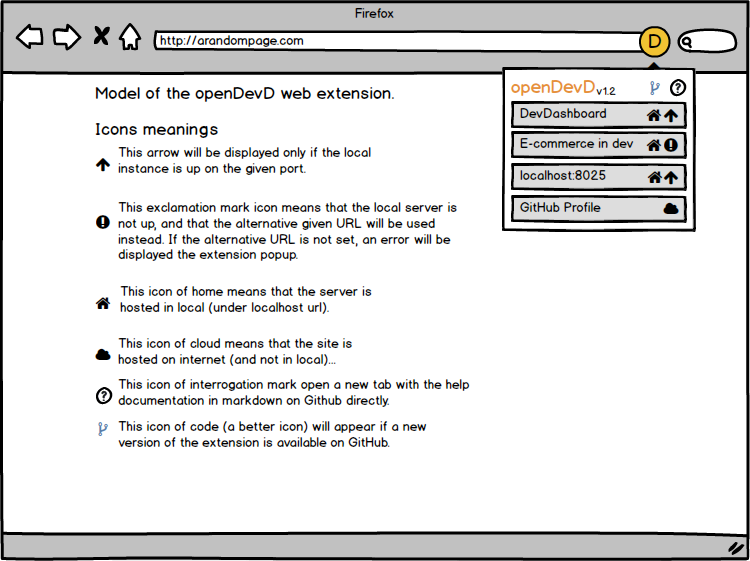

# About this extension

## Goals of the project
This is a very little project, only **to take in hand web extensions building**.
- **Make a first web extension** with a bit of challenge and follow guides for the building from A to Z (
- **Discover and learn WebExtension programming**, by practice ad by reading the Mozilla documentations
- **Understand how extensions are built** (structure of files, possibilities and API availables, ...)
- Build a very little tool that **will be useful for me** (and that can be useful for other local apps, just by changing URL).
- **Publish the app on AMO**. (To learn first. Maybe it will be useful for other devs. No big ambition :)).
- **Train for future web extensions projects**... (Too much idea in my head).
- **Train TailwindCSS and VueJS** (and how to integrate them).

## Ressources that helped me:
- [Your first extension - MDN](https://developer.mozilla.org/fr/docs/Mozilla/Add-ons/WebExtensions/Your_first_WebExtension)
- [Your second extension - MDN](https://developer.mozilla.org/fr/docs/Mozilla/Add-ons/WebExtensions/Your_second_WebExtension)
- [Extension workshop](https://extensionworkshop.com/)
- https://developer.mozilla.org/fr/docs/Mozilla/Add-ons/WebExtensions
- https://github.com/mdn/webextensions-examples

`Model of the design planned:`  
