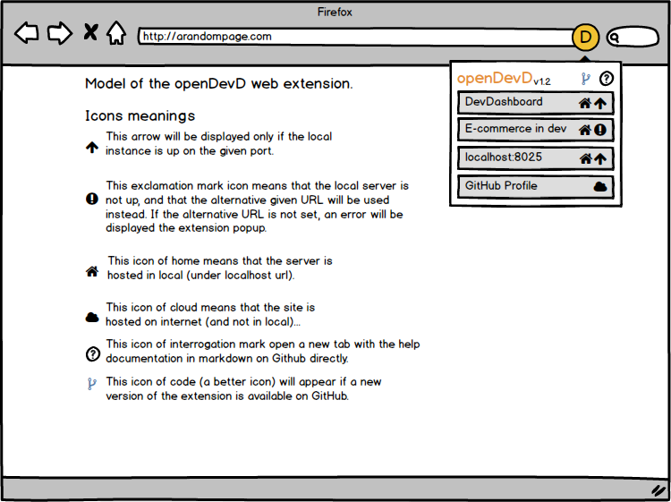

# openDevD

### Access quickly to local or remote development-related applications.

`Model of the design planned:`  

## Goals of the app
- Open quickly a local server (without typing `localhost:8056` by hand, and changing ports numbers between servers, ...)
- Open quickly links on remote apps (like GitHub repos, tasks management software, blogs, ...)
- Separate links by projects to keep the list short and not off-topic.

## Features
1. **Open a local app**:
	1. Open a *local html file* (URL ex: `file:///C:\users\me\.....\DevDashboard\index.html`)
	1. Open *a local server*. (URL ex: `localhost:8056` and naming it more clearly with the name of the server or the project and include the favicon).
	1. Open on priority the local server, and if not up, open the html file.
1. Manage links and configurations.
1. Visit the manual to learn how configurations works.
1. Automatic alert when a new version is available/released on GitHub or on AMO (addons.mozilla.org).

## Credits
### Librairies
- TailwindCSS - [MIT](https://github.com/tailwindlabs/tailwindcss/blob/master/LICENSE)  
Copyright (c) Adam Wathan <adam.wathan@gmail.com>  
Copyright (c) Jonathan Reinink <jonathan@reinink.ca>  
- VueJS - [MIT](https://github.com/vuejs/vue/blob/dev/LICENSE)  
Copyright (c) 2013-present, Yuxi (Evan) You
### Fonts
- Jetbrains Mono - [OFL](https://github.com/JetBrains/JetBrainsMono/blob/master/OFL.txt)  
Copyright 2020 The JetBrains Mono Project Authors (https://github.com/JetBrains/JetBrainsMono)
### Icons
Found with [iconduck.com](https://iconduck.com).
- Fluent UI System Icons  [MIT](https://github.com/microsoft/fluentui-system-icons/blob/master/LICENSE)  
Copyright (c) 2020 Microsoft Corporation
- Material Design Icons - [Apache License 2.0](https://github.com/Templarian/MaterialDesign/blob/master/LICENSE)
- Majesticons Icons Set - [MIT](https://github.com/halfmage/majesticons/blob/main/LICENSE)  
Copyright (c) 2021 Gerrit Halfmann

--- 
## Goals of the project
This is a very little project, only **to take in hand web extensions building**.
- **Make a first web extension** with a bit of challenge and follow guides for the building from A to Z (
- **Discover and learn WebExtension programming**, by practice ad by reading the Mozilla documentations
- **Understand how extensions are built** (structure of files, possibilities and API availables, ...)
- Build a very little tool that **will be useful for me** (and that can be useful for other local apps, just by changing URL).
- **Publish the app on AMO**. (To learn first. Maybe it will be useful for other devs. No big ambition :)).
- **Train for future web extensions projects**... (Too much idea in my head).
- **Train TailwindCSS and VueJS** (and how to integrate them).

## Ressources that helped me:
- [Your first extension - MDN](https://developer.mozilla.org/fr/docs/Mozilla/Add-ons/WebExtensions/Your_first_WebExtension)
- [Your second extension - MDN](https://developer.mozilla.org/fr/docs/Mozilla/Add-ons/WebExtensions/Your_second_WebExtension)
- [Extension workshop](https://extensionworkshop.com/)
- https://developer.mozilla.org/fr/docs/Mozilla/Add-ons/WebExtensions
- https://github.com/mdn/webextensions-examples
