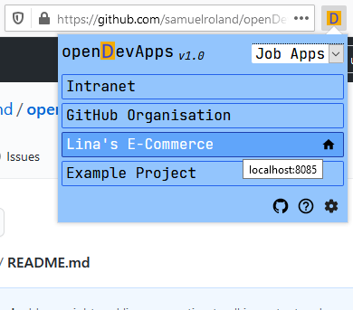
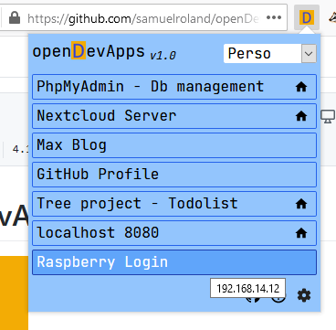

<!-- 
    openDevApps - Open quickly local or remote development-related apps, through a small list of links.
    Copyright (C) 2021 Samuel Roland

    This program is free software: you can redistribute it and/or modify
    it under the terms of the GNU General Public License as published by
    the Free Software Foundation, either version 3 of the License, or
    (at your option) any later version.

    This program is distributed in the hope that it will be useful,
    but WITHOUT ANY WARRANTY; without even the implied warranty of
    MERCHANTABILITY or FITNESS FOR A PARTICULAR PURPOSE.  See the
    GNU General Public License for more details.

    You should have received a copy of the GNU General Public License
    along with this program.  If not, see <https://www.gnu.org/licenses/>.
-->

# openDevApps

### Open quickly local or remote development-related apps, through a small list of links.
This is an **opensource web extension** licensed under **[GNU GPLv3 or later](/LICENSE.txt)**. It's dedicated to developers who want to open their web apps faster. It use VueJS, TailwindCSS and Jetbrains Mono. **Only available for Firefox Desktop 57.0+**.

 | 

## Features
- **Open quickly the links you have set.** All HTTP links are valid. (`localhost:8056`, `127.0.0.1`, `192.168.11.45:80/app`, `app.local`, `https://github.com/about`). 
- **Manage the links and categories** (to create and delete).
- **Separate links by categories** (categories can be projects, life domains, perso/pro, ...) to keep the lists short, on-topic and to find the links you are looking for more quickly.

## Planned features
- Translations support (first to do a french translation)
- Open all links in the current categories
- Add the current tab link to the current category (fill the link and propose the name with the tab title)

## Contributions
If you want to contribute to make this extension better, you're very welcome. There are currently 4 manners to contribute:

1. **Bugs/feedback/suggestions**: If you found a bug, have an idea for an enhancement or a new feature, or you just want to give a feedback, just open an issue and describe it and why you think it will be valuable ! **(Write only in English please)**. 
1. **Contribute to reflections**: To contribute to reflections in progress about the new features to implement, look at [the issues labelled `help wanted`](https://github.com/samuelroland/openDevApps/issues?q=is%3Aissue+is%3Aopen+label%3A%22help+wanted%22) and share your opinions or ideas ! You can thumb up the new features the most valuable to show your interest.  
1. **Contribute with code**: If you know the VueJS framework (and/or HTML CSS Tailwindcss), search an issue that you find interesting, say that you want to work on the issue and we will organise before you start to code. Then you can fork the repos, code and open a new PR.  
1. **Contribute with texts**: If you think the manual or some docs must be enhanced, or you want to add a new translation, open a new issue to describe what can be enhanced and how to think to will make it better, before starting to write content. Then you can fork the repos, code and open a new PR.

## Build
If you want to build the extension from the source, you need:
- Windows 10, MacOS, Linux
- NPM v6^

### Process
- Clone the repos, open a shell
- `cd openDevApps`
- `cd extension`
- `npm install`
- `npm run build`

The build is now available in the `dist` or as `.zip` file under `artifacts` (name like `opendevapps-v1.0.1-production.zip`). It's not signed by Mozilla so you can only install it temporarly.

## Install temporarly unsigned `.zip` or .`xpi`
1. Go to `about:debugging`
1. Under This Firefox, click `Load a temporary module` and select the file
1. The module is available until you close Firefox.

## Install signed versions
### Install with a `.xpi` or a `.zip` downloaded
1. Go to `about:addons`
1. Click on the settings icon
1. Install Add-on from file
1. Select the extension file
1. Click `Add`

--> The extension is correctly installed if you can open it as popup at the top right of your browser (you should the see the extension icon and click on it).

### Install from `.xpi` under a download link
1. Click on the download link
1. Follow step 5 in the precedent procedure

## Develop
If you want to develop the extension:
- `cd extension`
- `npm install`
- `npm run serve`
- Follow the procedure `Install temporarly unsigned .zip or .xpi` and select the file `extension/dist/manifest.json`. The `dist` folder contains the extension code transpiled by webpack.
- Go to `about:debugging` and click `Inspect` for the extension.
- Now you can start to develop in your IDE (`npm run serve` will build the code at each save) and to see changes just type F5 in the debugging tab. The extension will be reloaded. Look at [this article](https://extensionworkshop.com/documentation/develop/debugging/#debugging-popups).
- When you want to build the extension, change `manifest.json` and `package.json` versions and follow the build process (`npm run build`).

## Versions
All versions are published on GitHub under the [releases panel](https://github.com/samuelroland/openDevApps/releases), including the `.xpi` file and the source code. When browsing with Firefox, a simple click on the `.xpi` file is enough to launch the installation setup. The version names are the same in `package.json` and `manifest.json`.

- **Production** versions are available on GitHub et on [addons.mozilla.org](https://addons.mozilla.org/addon/opendevapps).  
Names are built like that **MAJOR.MINOR** (for example `1.2` stand for v1.2).
- **Beta** versions are only available on GitHub, and don't have automatic updates (at the moment). Suscribe to releases notifications to keep informed.  
Names are built like that **MAJOR.MINOR.BETA-NUMBER** (for example `1.2.2` stand for v1.2 beta 2).

## Credits
### Librairies
- TailwindCSS - [MIT](https://github.com/tailwindlabs/tailwindcss/blob/master/LICENSE)  
Copyright (c) Adam Wathan <adam.wathan@gmail.com>  
Copyright (c) Jonathan Reinink <jonathan@reinink.ca>  
- VueJS - [MIT](https://github.com/vuejs/vue/blob/dev/LICENSE)  
Copyright (c) 2013-present, Yuxi (Evan) You
### Fonts
- Jetbrains Mono - [OFL](https://github.com/JetBrains/JetBrainsMono/blob/master/OFL.txt)  
Copyright 2020 The JetBrains Mono Project Authors (https://github.com/JetBrains/JetBrainsMono)
### Icons
Found with [iconduck.com](https://iconduck.com).
- Fluent UI System Icons  [MIT](https://github.com/microsoft/fluentui-system-icons/blob/master/LICENSE)  
Copyright (c) 2020 Microsoft Corporation
- Material Design Icons - [Apache License 2.0](https://github.com/Templarian/MaterialDesign/blob/master/LICENSE)
- Majesticons Icons Set - [MIT](https://github.com/halfmage/majesticons/blob/main/LICENSE)  
Copyright (c) 2021 Gerrit Halfmann
